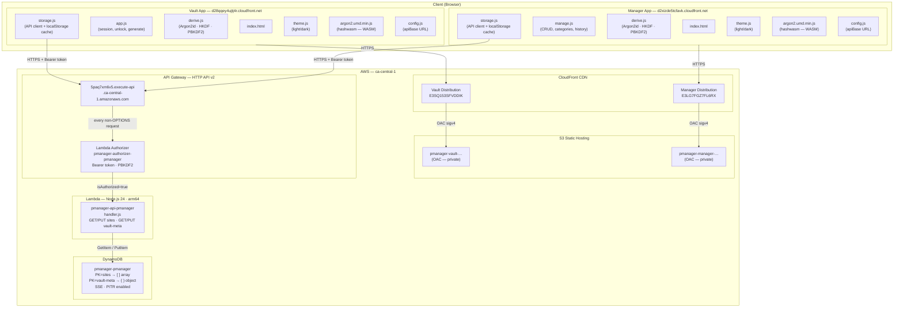
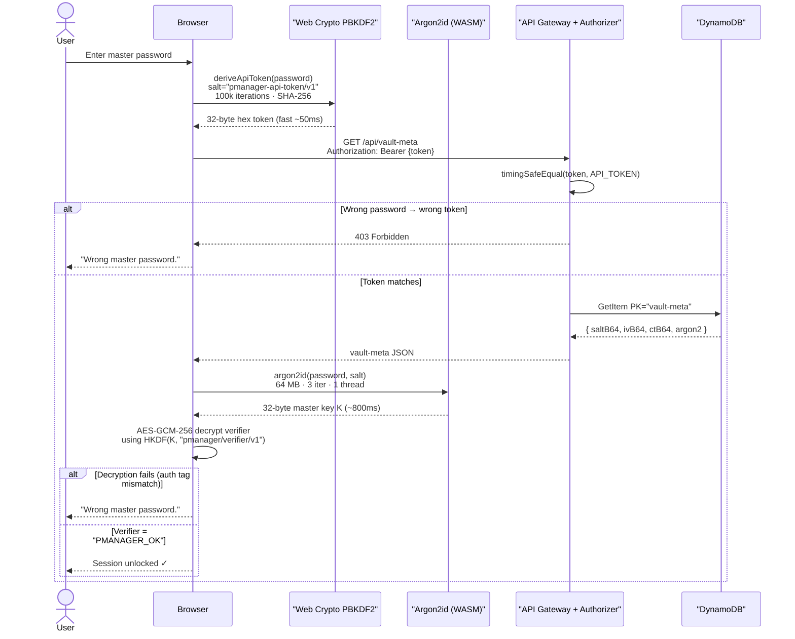
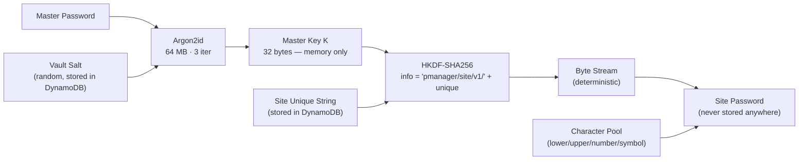
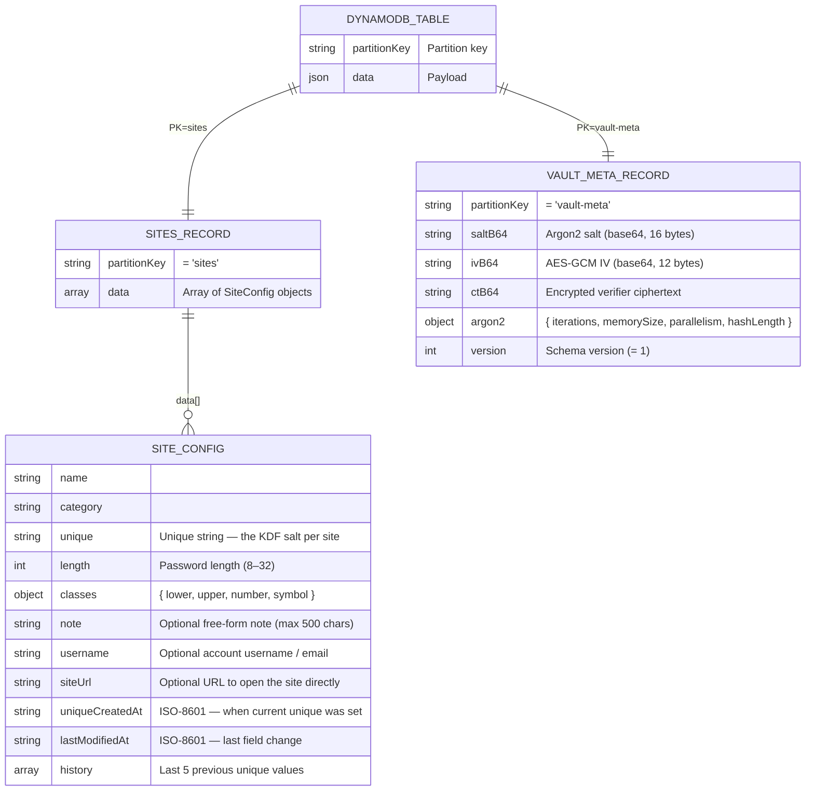
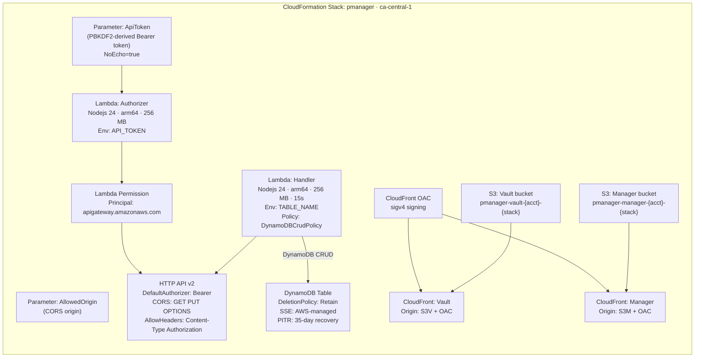
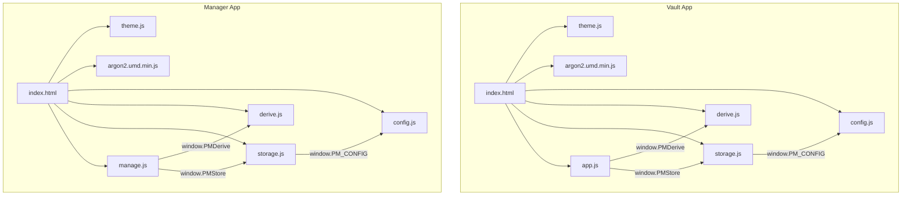
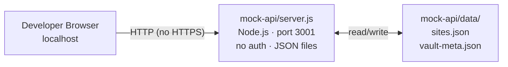
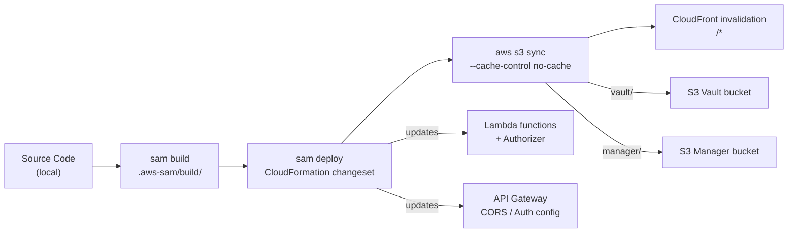

# pManager — Full System Architecture

## Overview

pManager is a **stateless, zero-knowledge password manager** deployed entirely on AWS serverless infrastructure. Passwords are never stored anywhere — they are **deterministically derived** on the client from a master password + a unique site string using Argon2id + HKDF. The backend stores only site configuration metadata and an encrypted verifier blob.

---

## High-Level System Diagram

---

## Authentication Flow

---

## Password Derivation (Zero-Knowledge)

**Key property:** The same `(master password, unique string)` pair always produces the same site password. Nothing is stored — the password vanishes when the session locks.

**Password composition rules (enforced at generation time):**

| Rule | Detail |
|---|---|
| **Length** | 8–32 characters (set per-site in the Manager) |
| **Character classes** | Lowercase · Uppercase · Numbers · Symbols — each toggled per site |
| **Symbol pool** | `!@#$` |
| **Minimum class coverage** | Every enabled class contributes ≥ 1 character to the final password |
| **No repetitive characters** | A character cannot appear consecutively (e.g. `aa`, `11`) |
| **No sequential characters** | Adjacent characters in the same class cannot differ by 1 code point (e.g. `ab`, `78`, `YZ`) |

---

## Data Model

---

## Infrastructure (AWS SAM / CloudFormation)

---

## Frontend Module Dependency

---

## Local Development

Set `apiBase: "http://127.0.0.1:3001"` in `config.js` to use the mock server locally.

---

## Security Properties

| Property | Mechanism |
|---|---|
| **Passwords never stored** | Derived at runtime via Argon2id + HKDF; wiped on lock |
| **API protected** | PBKDF2 Bearer token derived from master password |
| **Token comparison** | `crypto.timingSafeEqual` — immune to timing attacks |
| **CORS preflight** | OPTIONS passthrough; all data methods require Bearer token |
| **Vault data encrypted** | AES-GCM-256 verifier; site configs stored in plaintext (not sensitive) |
| **S3 not public** | CloudFront OAC + sigv4 — S3 buckets have no public access |
| **DynamoDB at rest** | SSE enabled (AWS-managed key) |
| **DynamoDB recovery** | Point-in-time recovery — 35-day window |
| **Session timeout** | 5-minute inactivity lock; master key wiped from memory |
| **No master password stored** | Wiped from DOM immediately after Argon2 derivation |

---

## Deployment Pipeline

**Script:** `bash aws/deploy-frontend.sh` — runs all steps end-to-end.
